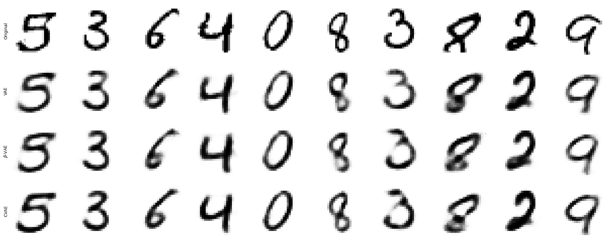
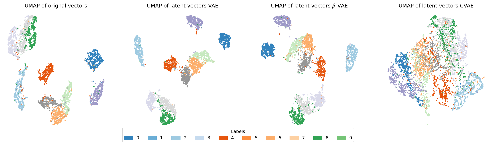
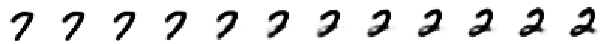
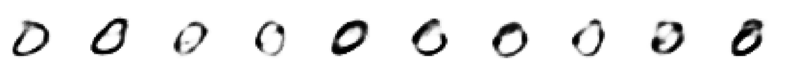

# Comparing VAE vs $\beta$-VAE vs CVAE generative neual network models on the MNIST dataset


In this project, I implemented a general VAE Python class that can adapt to any of the models above. The class is built using [PyTorch](https://pytorch.org/) under the standard [``torch.nn.Module``](https://docs.pytorch.org/docs/stable/generated/torch.nn.Module.html) structure and trained with its [``torch.optim``](https://docs.pytorch.org/docs/stable/optim.html) API. Hence, all of the [``torch.nn``](https://docs.pytorch.org/docs/stable/nn.html) methods are compatible with this class, including the posibility of running the model in an NVIDIA GPU. 

As any Machine Learning model class, it implements its own ``.fit`` method to train the model on some dataset and also implements a ``.rsample`` method to draw a random sample of generated values in the original space. All the code concerning such implementation can be found in the [vae.py](vae.py) file.

This code can be used for new projects, when an existant implementation of a VAE with a simple & familiar interface is needed.

In the other hand, the [test.ipynb](test.ipynb) is a Jupyter Notebook that implements a direct comparision of these models when trained on the famous [MNIST dataset](https://en.wikipedia.org/wiki/MNIST_database). Such comparision includes 

### Data reconstruction


### Latent space visualization


### Image interpolation


### Image generation


## Generative Models

In machine learning, a probabilistic model that learns the joint distribution $p(x,y)$ is called a **generative model**. In many cases the joint distribution is factorized as $p(x,y)=p(x|y)p(y)$. Because the joint distribution is modeled, the conditional distribution $p(y|x)$ can be obtained using Bayes' theorem.

```math
p(y|x) = \frac{p(y)p(x|y)}{\sum_{y'\in Y} p(y')p(x|y')}
```

## Variational Autoencoder

In the past decade, generative models have become more and more complex with the massive adoption of Neural Networks by the scientific comunity. One of the first famous generative models based on neural networks are the **variational autoencoders** (VAEs) which are the probabilistic evolution of the **autoencoder** model. A classic VAE is defined as follows.

Let $x$ and $z$ be random variables with some proposed distributions

```math
\begin{align*}
z &\sim p(z|\theta)\\
x|z &\sim p(x|z,\theta)
\end{align*}
```

Hence, their joint distribution is given by $`p(x,z|\theta) = p(z|\theta)p(x|z,\theta)`$.

Let $q(z|x,\phi)$ be a new probabilistic distribution called the **recognition model**.

The idea is to train such probabilistic models so that $`q(z|x,\phi)\approx p(z|x,\theta)`$. This is done by maximizing the [ELBO](https://en.wikipedia.org/wiki/Evidence_lower_bound) (Evidence Lower Bound) which is defined as


```math
\begin{align*}L(\theta,\phi,x) &= \mathbb{E}_{z\sim q(z|x,\phi)}\left[\log\ p(x,z|\theta)-q(z|x,\phi)\right]\\&= \mathbb{E}_{z\sim q(z|x,\phi)}\left[\log\ p(x|z,\theta)\right]-D_\mathbb{KL}\left(q(z|x,\phi)\ ||\ p(z|\theta)\right)\end{align*}
```

For practical applications, we may assume that the proposed distributions are all Gaussians. In particular, if we define
* $`p(z|\theta) = \mathcal{N}(z|0,I)`$
* $`p(x|z,\theta) = \mathcal{N}\left(x|\tau(z,\theta),\alpha^2 I\right)`$
* $`q(z|x,\phi) = \mathcal{N}\left(z|\mu(x,\phi),\text{diag}\left(\sigma^2(x,\phi)\right)\right)`$

where $\mu,\tau$ and $\sigma$ are neural networks. We can easily identify $\tau$ as the **encoder** and $\mu$ as the **decoder** in a similar sense to the ones in the autoencoder model. 

Hence, the KL-divergence of two Gaussians has an analytic expression, given by

```math
D_{\mathbb{KL}}(q(z|x,\phi)||p(z)) = -\frac{1}{2}\sum_{j}\left[\log\ \sigma_j^2(x,\phi)-\sigma_j^2(x,\phi)-\mu_j^2(x,\phi)+1\right]
```

Nevertheless, there is a big problem with the current formulation. Note that the expected value still does not have a closed form, so we completely depend on [Monte Carlo integration](https://en.wikipedia.org/wiki/Monte_Carlo_integration) to determine its value. But sampling procedures are not differentiable, so this step breaks any hopes of using a numeric differential optimization algorithm to train the model.

We can exploit the fact that $q(z|x,\phi)$ is a Gaussian by applying the following change of variables. Let $`\epsilon\sim\mathcal{N}(0,I)`$ then $`z = \mu(x,\phi) + \sigma(x,\phi)\odot\epsilon\sim q(z|x,\phi)`$. Thus, the expected value becomes

```math
\mathbb{E}_{\epsilon\sim\mathcal{N}(0,I)}\left[\log\ p(x|\mu(x,\phi) + \sigma(x,\phi)\odot\epsilon,\phi)\right]
```

which can be safely approximated via Monte Carlo integration, as the sampling will be done on $\epsilon$ and not on $z$. This last process is called the **reparametrization trick**.

There are many versions and generalizations of VAEs, from the distribution-type selection to the optimization techniques. Some of these are briefly described in the next sections.

## $\beta$-Variational Autoencoder

A $\beta$-VAE is a generalization of VAEs but with a new parameter $\beta>1$ that scales the KL-divergence term in the ELBO to force more independence in the latent space, which tends to improve the latent representation of some distributions.

```math
L(\theta,\phi,x,\beta) = \mathbb{E}_{z\sim q(z|x,\phi)}\left[\log\ p(x|z,\theta)\right]-\beta D_\mathbb{KL}\left(q(z|x,\phi)\ ||\ p(z|\theta)\right)
```

## Conditional Variational Autoencoder

A Conditional VAE (CVAE) introduces conditional information (e.g. class labels) into both the encoder and decoder. By conditioning on $y$, the latent variable $z$ only needs to model the variability of $x$ given that condition, which helps the model learn more structured latent representations.

```math
\begin{align*}
z &\sim p(z|y,\theta)\\
x|z &\sim p(x|y,z,\theta)
\end{align*}
```

## MNIST dataset

The **MNIST** (Modified National Institute of Standards and Technology) dataset is a widely used benchmark dataset in machine learning and computer vision for handwritten digit recognition. It contains 70,000 grayscale images of handwritten digits (0–9), each sized 28×28 pixels, split into 60,000 training images and 10,000 test images. The dataset was created by Yann LeCun and collaborators and is derived from digit samples collected by the National Institute of Standards and Technology.

## About AI usage in this project
ChatGPT was used to add the docstrings in the [vae.py](vae.py) code.